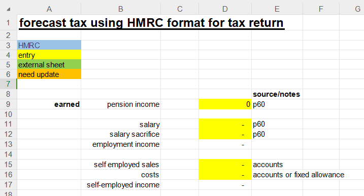

## Download links

This spreadsheet mirrors the HMRC "view my calculation" screen at the end of your tax return. Have not found any similar spreadsheet available to do this. It can be downloaded using the button here...  
 
## Purpose

1. Better understand the HMRC calculation especially the interaction of income, capital gains and dividends.
2. Forecast how much income is in the high and low rate bands so that you can optimise tax
    * Reduce the amount of income in the high rate band e.g using pension contributions or shifting income into another tax year
    * Generate gains to utilise unused basic rate allowance. This will taxed at the 10% tax rate now in anticipation that rates will increase in the future.
    * Estimate how much tax will be due to enable cash flow planning
3. Check the tax return has been fully completed and is correct

## Usage

* Blue cells are pre-populated with HMRC data for the year
* Yellow cells are for entering data using estimates, P60 or other documents
* Amber cells are to highlight things that need updates
* Green cells are for links to other spreadsheets OR for entering data

Rows labelled "CHECK TAX RETURN" should match the HMRC calculation view at the end of the tax year.

## Included

* income from pension, self-employed, employed
* salary sacrifice
* pension contributions
* national insurance class 2,3,4
* dividends
* capital gains
* student loans plan 1 (to 2012), plan 2 (2012-2023)

## Excluded

* additional rate tax band
* high income reduction of the personal allowance
* student loans plan 4 Scotland, plan 5 2023-, postgrad loans
* insurance contracts
* special rates for married women, fishermen etc.
* anything else not listed